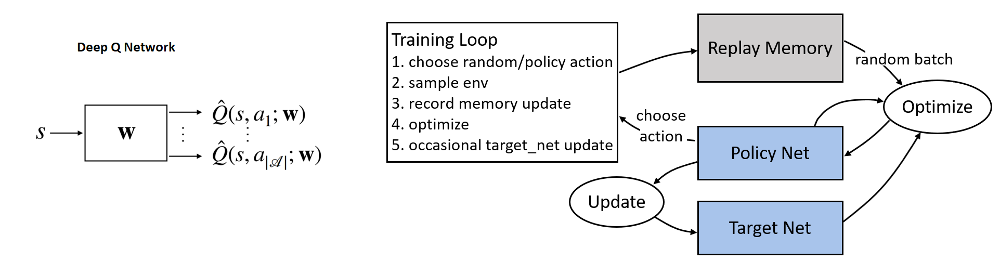

# DQN_freeway

### Deep Q-Learning (DQN) algorithm for atari 2600 Freeway

There are three critical components:
* The main component of this algorithm is the deep Q-networks. We can use them to approximate the state-action value.
* The experience replay buffer keeps the state transition information and removes correlationof adjacent samples.
* During the training phase there is another target Q-network to increase stability.

### References

* DQN algorithm: [Human-level control through deep reinforcement learning(V Mnih, 2015)](https://www.nature.com/articles/nature14236).
* PyTorch reinforcement learning tutorial: https://pytorch.org/tutorials/intermediate/reinforcement_q_learning.html
* OpenAI Gym: https://gym.openai.com/docs/